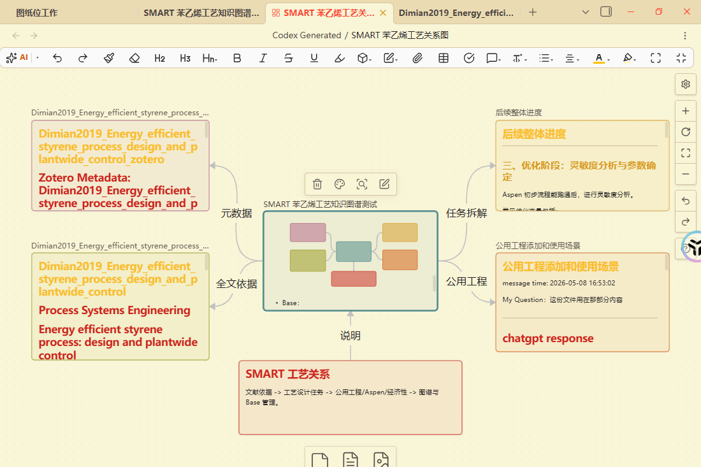
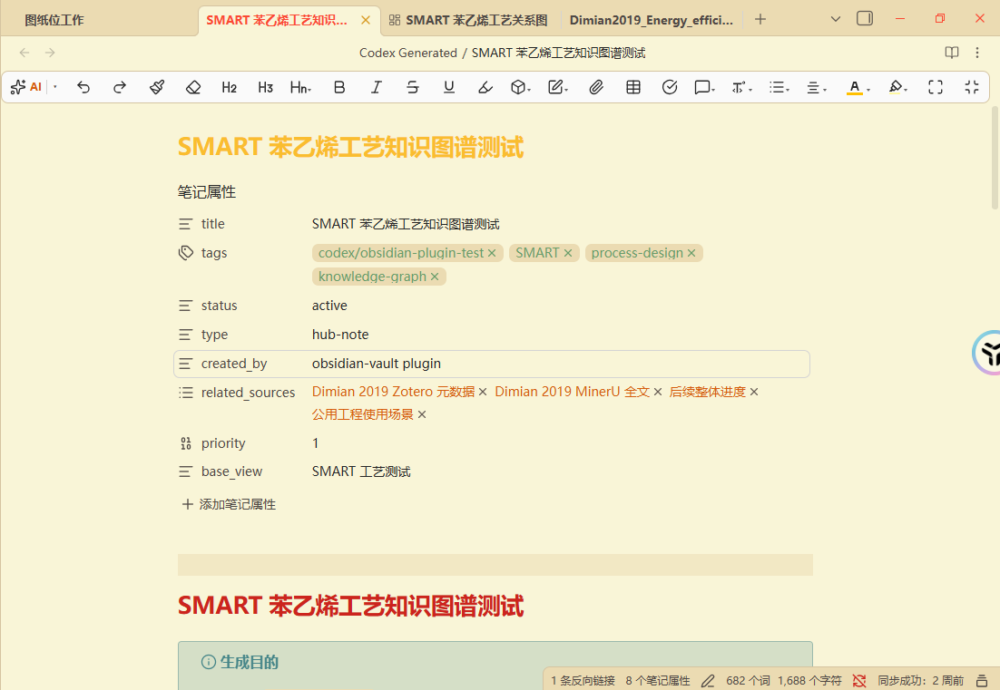
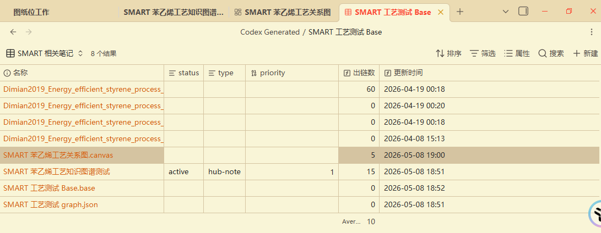

# Obsidian Vault Codex Plugin Reference

This reference publishes the `obsidian-vault` Codex plugin package.

## What It Does

`obsidian-vault` helps Codex maintain local Obsidian vaults as persistent linked wikis. It includes:

- Vault file listing, search, read, write, and note creation tools.
- YAML frontmatter/property editing.
- Wiki double-link creation.
- Backlink-aware graph generation.
- JSON Canvas creation.
- Obsidian Bases creation.
- Local Obsidian CLI integration.

## Demo Screenshots







## Design References

This package explicitly borrows from two ideas:

- [Kepano's Obsidian Skills](https://github.com/kepano/obsidian-skills): split Obsidian work into modular Markdown, Canvas, Bases, CLI, and extraction-oriented workflows.
- [Karpathy's LLM Wiki](https://gist.github.com/karpathy/442a6bf555914893e9891c11519de94f): treat Obsidian as a persistent LLM-maintained wiki where knowledge accumulates through source ingestion, cross-links, graph health checks, index/log files, Canvas maps, and reusable views.

## Package

Download the full plugin package:

- [obsidian-vault-plugin.zip](./obsidian-vault-plugin.zip)

The zip contains:

```text
obsidian-vault/
  .codex-plugin/plugin.json
  .mcp.json
  README.md
  requirements.txt
  assets/screenshots/
  docs/
  scripts/obsidian_vault_mcp.py
  skills/obsidian-vault/SKILL.md
```

## Install

1. Extract `obsidian-vault-plugin.zip`.
2. Copy `obsidian-vault/` into your local Codex plugin directory or plugin marketplace source.
3. Install Python dependencies:

```bash
python -m pip install -r requirements.txt
```

4. Open Obsidian 1.12.7 or newer.
5. Confirm the core plugins `bases`, `canvas`, and `properties` are enabled.
6. Leave `.mcp.json` as `OBSIDIAN_VAULT_PATH=auto`, or set an explicit vault root.

## Portability Notes

- No local absolute vault path is embedded in the package.
- File writes are constrained to the resolved vault root.
- Non-vault folders are rejected by default unless `OBSIDIAN_ALLOW_NON_VAULT=true`.
- Existing files require `overwrite=true` before replacement.
